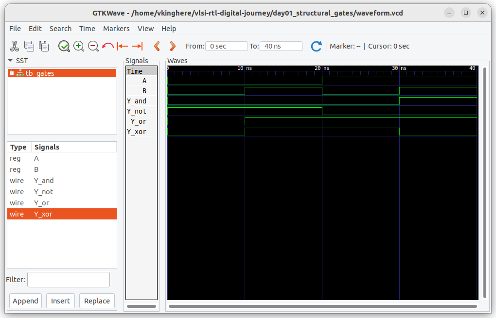

# Day 1 - Structural Gates

## ✅ Topics Covered
- AND, OR, NOT, XOR gate-level Verilog
- Writing and testing structural modules
- Simulating with Icarus Verilog + GTKWave

## 💻 Learnings
- Structural style mirrors wiring of real gates
- Signal propagation follows gate instantiation

## 🧠 Memory Hooks
- Think of `and(Y, A, B)` as physical gate with output wire Y
- Use `$dumpfile` and `$dumpvars` in every testbench!

## ⏳ Time Spent
- [Log your time here]

## 📸 Screenshots
- 

