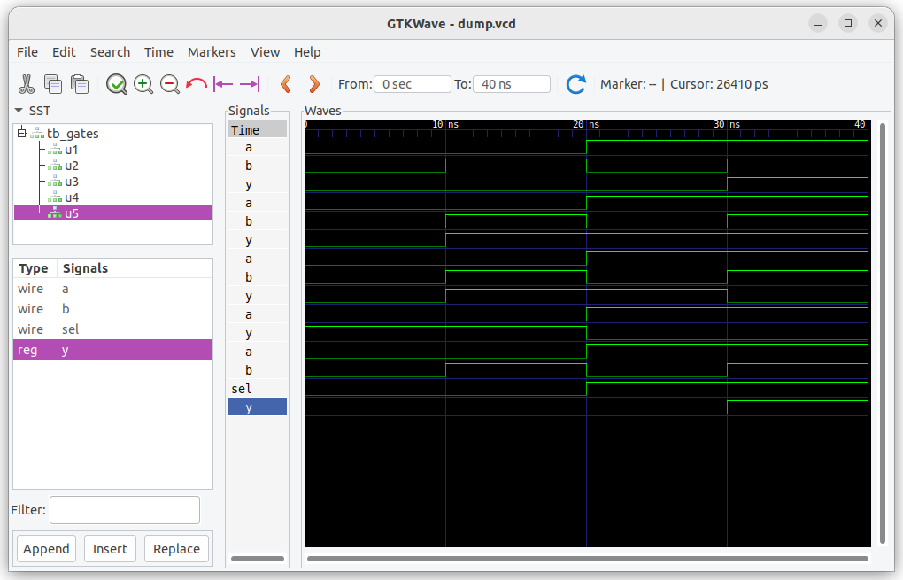

# Day 2 - Behavioural Gates

## ✅ Topics Covered
- AND, OR, NOT, XOR gate-level Verilog
- Writing and testing behavioural modules
- Simulating with Icarus Verilog + GTKWave

## 💻 Learnings
## 💡 Learnings
- Learned how to model combinational logic using `always @(*)` blocks in Verilog (behavioral style).
- Implemented and simulated gates and a 2:1 multiplexer using behavioral modeling with testbenches.
## 🧠 Memory Hooks
- Think of `always @(*)` as "do this whenever **anything changes**" — no need to list all inputs manually.
- Ternary (`sel ? b : a`) is like a **light switch** choosing between two values — super handy for muxes.
## ⏳ Time Spent
- [30mins]

## 📸 Screenshots
- 

