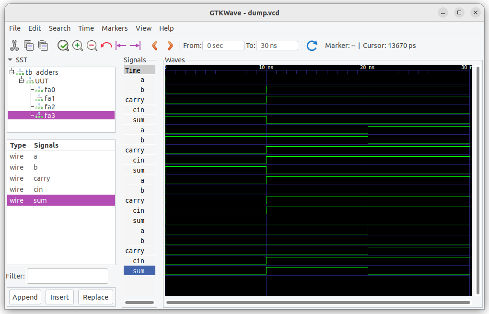

# Day 3 – Dataflow Modeling: Adders

## ✅ Topics Covered
- Dataflow modeling using `assign` keyword
- Designed Half Adder and Full Adder using Boolean expressions
- Built a 4-bit Ripple Carry Adder (RCA) by chaining full adders
- Simulated all modules and verified outputs using GTKWave

## 💻 Learnings
- `assign` enables direct expression of logic using Boolean operators
- RCA demonstrates modular design: outputs feed into next stage's inputs

## 🧠 Memory Hooks
- `assign` feels like **direct wires** between logical expressions — no control flow needed
- Ripple Carry = like a **relay race**, each carry passed to the next stage

## ⏳ Time Spent
- [30mins]

## 📸 Screenshots
- 

